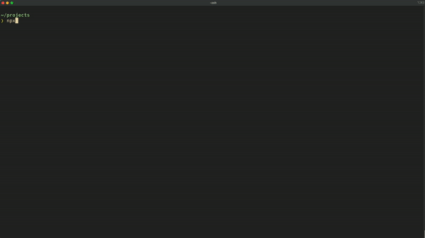

# create-nvim-plugin

A tool to quickly scaffold neovim lua plugins.

## Usage

Launch an interactive prompt using your favourite package manager.

`npx create-nvim-plugin`

`yarn create nvim-plugin`

`pnpm create create-nvim-plugin`

Enter the plugin name and the scaffolding will begin

This will create a directory under the name you specified with the plugin barebones setup for you.

## Credit

[m00qek](https://github.com/m00qek/plugin-template.nvim) For the plugin-template.nvim repository which provided the project template inspiration.

